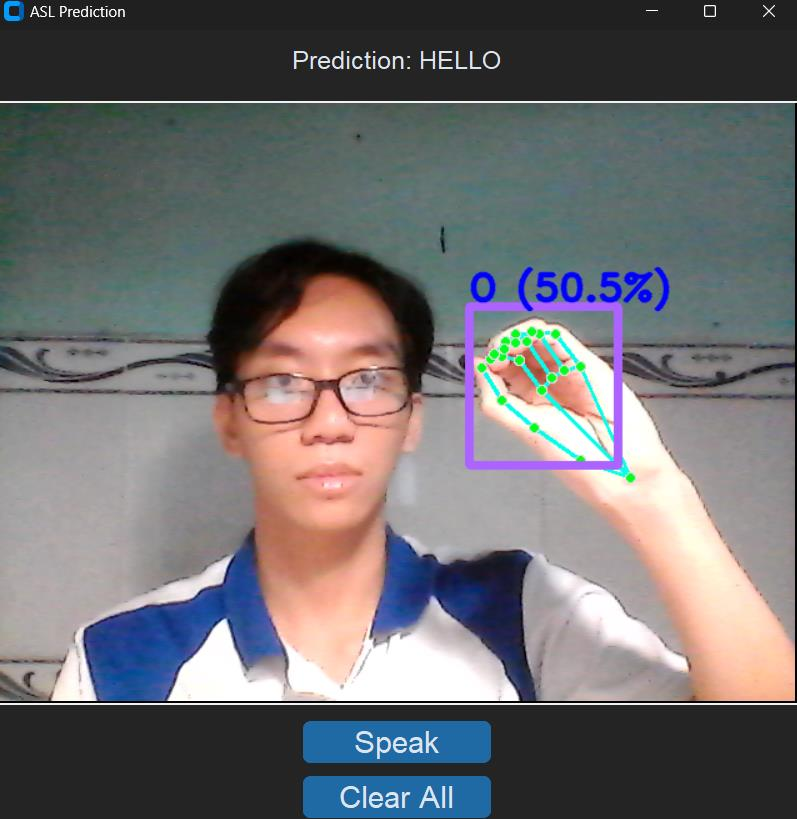
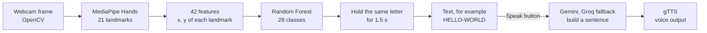
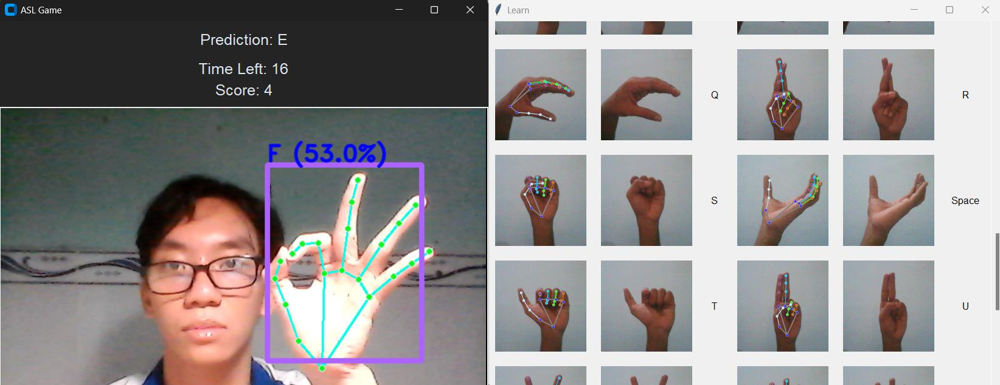
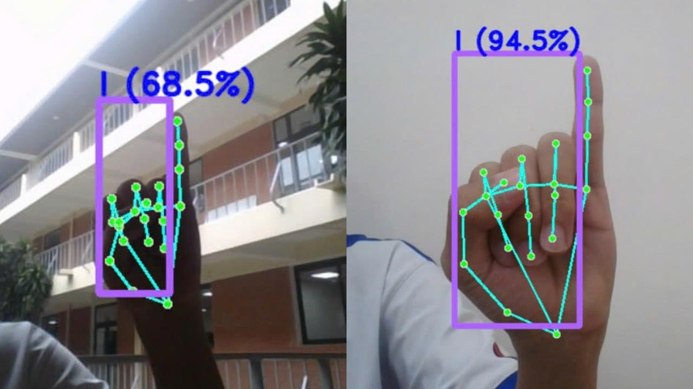

# ASL Fingerspelling Recognition

A desktop app that reads American Sign Language (ASL) letters from a webcam. MediaPipe finds the 21 hand landmarks in each frame and a scikit-learn Random Forest classifies them into 26 letters plus Space and Del. Letters held steady are typed into a word, an LLM turns the letters into a sentence, and the app reads it out loud. It also has a timed game and a learning mode.

This is a course project for Python Programming at HCM-UTE (team of 4, December 2024). The full report is in Vietnamese: [BAOCAO_NHOM18_BAOCAO.pdf](BAOCAO_NHOM18_BAOCAO.pdf). Demo video: [YouTube](https://youtu.be/d4oEQkpHCeI).

Trained model on Hugging Face: [asl-fingerspelling-rf](https://huggingface.co/TicassloThang/asl-fingerspelling-rf).



## Overview

- Built the training data from public Kaggle ASL alphabet images: ran MediaPipe Hands on every image and kept the x, y of the 21 landmarks (42 numbers per image), which gives 166,811 samples over 28 classes.
- Trained a Random Forest (200 trees, max depth 35) on these features. The report gives 99.6% mean cross-validation accuracy on the Kaggle images (see [Results](#results) for what this number does and does not mean).
- Built three modes on one CustomTkinter menu: ASL to text and voice, a timed sign game, and a "Learn the ASL" page.
- Used Gemini (with Groq as a fallback) to turn spelled letters such as `HELLO-NICE-TO-MEET-U-BUT-I-GTG` into a normal sentence before speaking it with gTTS.

## How it works



### Data and features

1. **Images**: Kaggle ASL alphabet images for A to Z, Space, Del and Nothing. We started from the dataset used in Al Fath Terry's [notebook](https://www.kaggle.com/code/alfathterry/american-sign-language-real-time-detection) and added another Kaggle ASL alphabet dataset. The exact list of sources was not written down at the time. `collect_imgs.py` can also collect your own photos from the webcam.
2. **Feature extraction** (`data_extraction.py`): MediaPipe Hands in static image mode (detection confidence 0.9) on each image. The x and y of the 21 landmarks are saved in order (values are relative to the image, 0 to 1). Images where no hand is found are skipped, so the Nothing class drops out and 28 classes remain.
3. **Class balance**: the classes are uneven, from 555 samples (Del) and 830 (N) up to 8,096 (K).

### Model

| Setting | Value |
|---|---|
| Model | `RandomForestClassifier` (scikit-learn 1.5.2) |
| Trees | 200 |
| Max depth | 35 |
| Random state | 42 |
| Input | 42 numbers (x, y of 21 landmarks) |
| Classes | A to Z, Space, Del |
| Training script | `model_training.py` (15% hold-out split, accuracy printed at the end) |

### App modes

| Mode | File | What it does |
|---|---|---|
| ASL to Voice | `real_time_pre_with_tin2.py`, `geminiAI2.py` | Shows the predicted letter and confidence on the webcam view. A letter is added after it is held for 1.5 s, Space adds `-`, holding Del for 1.5 s removes the last letter. Speak sends the text to Gemini, then reads the sentence out loud. |
| ASL Sign Game | `signgame.py` | 30 second round. The game shows a random letter, and holding the right sign for 0.8 s scores a point. Music and sound effects with pygame. |
| Learn the ASL | `visualization.py` | Shows one sample image per class next to the same image with the MediaPipe landmarks drawn on it. |



## Results

The report lists this grid search over the Random Forest settings (mean cross-validation score on the Kaggle image features):

| n_estimators | max_depth | Mean CV accuracy |
|---|---|---|
| 100 | 20 | 99.497% |
| 200 | 20 | 99.525% |
| 200 | 30 | 99.602% |
| 200 | 35 | 99.604% |
| 200 | 40 | 99.602% |

What this number means:

- It was measured on Kaggle photos (plain background, good light), split at random. These datasets have many near-identical photos of the same hand, which end up in both the training and test parts, so it is much higher than what the app gets on a new person and a new room.
- The grid search code is not in this repository. Only the simpler hold-out script (`model_training.py`) is.
- On the live webcam, the confidence shown next to the letter (the share of trees that vote for it) was mostly between 60% and 90%, depending on light, background and camera. We did not measure accuracy on a labeled webcam test set.



## Limitations

- Raw landmark positions are used without moving the wrist to (0, 0) or scaling by hand size, so the prediction also depends on where the hand is in the frame and how far it is from the camera.
- J and Z need motion in real ASL. Here they are treated as still signs, and only one variant of each letter is used.
- Only one hand is used: if MediaPipe finds two hands, only the first 42 values go to the model.
- The model file is large (482 MB) because the trees are deep and many.
- The LLM models in `geminiAI2.py` (`gemini-1.5-flash-8b` and Groq `mixtral-8x7b-32768`) were shut down by their providers in 2025, so the sentence step will fail until the model names are changed. Letter recognition, the game and the Learn page do not need them.

## Tech stack

Python, MediaPipe, OpenCV, scikit-learn, NumPy, pandas, CustomTkinter, Tkinter, Pillow, Google Gemini API, Groq API, gTTS, pyttsx3, pygame

## Project structure

```
├── menu.py                    # Main menu, start here
├── real_time_pre_with_tin2.py # ASL to text and voice window
├── signgame.py                # Timed sign game
├── visualization.py           # Learn the ASL page
├── geminiAI2.py               # Gemini / Groq sentence building and text to speech
├── real_time_prediction.py    # Older version of ASL to voice in an OpenCV window
├── collect_imgs.py            # Collect your own photos from the webcam
├── data_extraction.py         # Images -> MediaPipe landmarks -> pickle
├── model_training.py          # Train and save the Random Forest
├── detectModel.py             # Print the settings of a saved model
├── asl_dataset_test/          # 113 sample Kaggle images (used by the Learn page)
├── datatest.csv, datatest.pickle, modeltest.p  # Small test data and model from those samples
├── gamemusic.mp3, scoreupwav.wav               # Game sounds
├── READ_ME_PLEASE.txt         # Original notes (Vietnamese)
└── BAOCAO_NHOM18_BAOCAO.pdf   # Report (Vietnamese)
```

## Run locally

You need Python 3.9 to 3.12 (mediapipe 0.10.14 has no wheels for newer versions) and a webcam.

1. Install the packages:

```bash
pip install -r requirements.txt
```

2. Download the model `model3_2.p` into the project folder:

```bash
hf download TicassloThang/asl-fingerspelling-rf model3_2.p --local-dir .
```

It is also on [Google Drive](https://drive.google.com/file/d/1y7kUcHx-Oh1inw-JxEP1pcDa7EnsfTAX/view?usp=sharing).

3. For the sentence step, set `GEMINI_API_KEY` and `GROQ_API_KEY` as environment variables (and update the model names, see Limitations).
4. Run the app:

```bash
python menu.py
```

To train your own model: put images in folders by label, run `data_extraction.py`, then `model_training.py`. Change the file names at the top of each script first.

## Team

- Huỳnh Ngọc Thắng: found and processed the data, trained and tuned the models, wrote and put together the report, presented the project
- Nguyễn Lâm Huy: letter recognition screen and voice output
- Nguyễn Thành Tài: the sign game
- Hồ Minh Tiến Thành: the user interface, main menu and the Learn page

We also helped each other across parts.

## Credits

- Al Fath Terry, [American Sign Language real-time detection](https://www.kaggle.com/code/alfathterry/american-sign-language-real-time-detection) (Kaggle notebook, Apache 2.0): the starting point for the data extraction, training and webcam loop.
- [Computer vision engineer](https://www.youtube.com/watch?v=MJCSjXepaAM) on YouTube: the photo collection script and an introduction to MediaPipe, OpenCV and scikit-learn.
- The ASL alphabet images come from public Kaggle datasets.

## License

[MIT](LICENSE)
